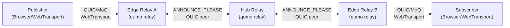
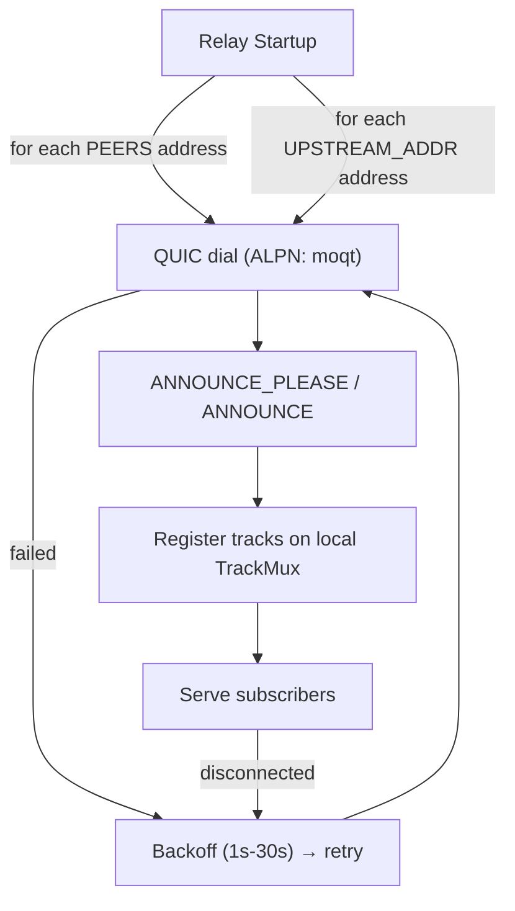

# qumo

[](https://github.com/qumo-dev/qumo/actions/workflows/ci.yml)
[](https://goreportcard.com/report/github.com/qumo-dev/qumo)
[](LICENSE)
[](https://qumo-dev.github.io/qumo/)

**qumo** is a high-performance Media over QUIC (MoQ) relay server with peer-based content discovery, enabling distributed media streaming over the QUIC transport protocol.

📚 **Documentation:** [https://qumo-dev.github.io/qumo/](https://qumo-dev.github.io/qumo/)

## Features

- 🚀 **High-Performance Relay**: Built on QUIC for low-latency media streaming
- 📡 **MoQT Protocol**: Full Media over QUIC Transport support (moq-lite draft-04)
- 🔗 **Peer-Based Topology**: Relays connect to each other via ANNOUNCE_PLEASE for decentralized content discovery
- 📊 **Observability**: Prometheus metrics, health probes, and status APIs
- 🔒 **TLS Security**: Built-in TLS 1.3 support for encrypted connections
- 🐳 **Docker-Support**: Env-var zero-config; prebuilt multi-arch images on GHCR (ghcr.io/qumo-dev/qumo)

## Installation

#### Option 1: Install via Go

```bash
go install github.com/qumo-dev/qumo@latest
```

#### Option 2: Download Binary

Download the latest archive from [GitHub Releases](https://github.com/qumo-dev/qumo/releases):

```bash
# Linux/macOS
curl -L https://github.com/qumo-dev/qumo/releases/latest/download/qumo_0.4.0_linux_amd64.tar.gz | tar xz
./qumo playground      # one-command demo: relay + web UI at http://127.0.0.1:8080

# Or for a standalone relay:
mage cert              # generate a dev cert (mkcert or self-signed)
./qumo relay           # start the relay (certs/server.crt + .key)

# Windows: download qumo_0.4.0_windows_amd64.zip from the releases page
```

#### Option 3: Docker

See [docker/README.md](docker/README.md) for compose examples, GHCR usage, and deployment options.

#### Option 4: Build from Source

```bash
git clone https://github.com/qumo-dev/qumo.git
cd qumo
mage build        # builds bin/qumo with version info
# or: go build -o qumo .
```

## Usage

```bash
qumo relay       # Start MoQ relay server (QUIC/MoQT, WebTransport, peer mesh)
qumo rtmp        # Start RTMP ingest server (bridges RTMP → MoQT)
qumo rtsp        # Pull from an RTSP source (e.g. IP camera) and republish as MoQT
qumo rtsp-push   # Start the RTSP push ingest server (bridges RTSP → MoQT)
qumo hls         # Start the HLS/DASH egress server (subscribes to a MoQ relay, serves HLS/DASH)
qumo playground  # One-command local demo: in-process relay + embedded web UI on http://127.0.0.1:8080
qumo loadgen     # Out-of-process capacity load generator (publish|subscribe) — see Benchmarking
qumo update      # Update qumo to the latest release (--check to verify without applying)
qumo version     # Print build-time version info
```

For environment variables and configuration, see `relay-config.example.env`. For Docker-based deployment, see [docker/README.md](docker/README.md).

### TLS — clients verify by default

qumo's servers (`relay`, `rtmp`, `rtsp`, `rtsp-push`, `playground`) present TLS from `CERT_FILE` / `KEY_FILE` (default `certs/server.crt` + `.key`; generate one with `mage cert`). The clients that dial a relay **verify its certificate by default** — verification is the default, not an opt-in:

- `qumo loadgen` and `tools/capacity` require the relay's cert as a trust anchor (`--ca <cert.pem>`), or `--insecure` for a self-signed dev relay. Verification is the default; `--insecure` is the explicit escape hatch.
- The bench/test clients follow the same convention: `bench-multiproc/tools/latency-probe` takes `--ca` or `--insecure`; `internal/smoketest` (the `mage smoke` harness) takes `-ca` or `-insecure`, with `mage smoke` passing `-insecure` against the self-signed Docker topology.
- `qumo hls` verifies against the system root store by default. Trust a specific relay cert with `RELAY_CA_FILE`, or disable verification for a self-signed dev relay with `RELAY_TLS_INSECURE=true`:

  ```bash
  qumo hls                                   # verify against the system roots
  RELAY_CA_FILE=certs/server.crt qumo hls    # trust this relay's cert
  RELAY_TLS_INSECURE=true qumo hls           # dev relay with a self-signed cert
  ```

`cmd/seed-moq`, the dev seeder, presents an ephemeral self-signed certificate — point the egress at it with `RELAY_TLS_INSECURE=true`.

## Architecture

### System Overview



### Peer Discovery

On startup, each relay dials peer addresses from two static, comma-separated env vars — there is no runtime service discovery:

1. **`PEERS`**: static peer addresses to dial and maintain a connection to.
2. **`UPSTREAM_ADDR`**: upstream relay address(es) to connect to (e.g. an edge relay dialing a hub, or any relay hierarchy). Accepts a DNS name that resolves to multiple/changing backends (e.g. `role-hub.qumo-relay.service.consul:4433`) as well as direct `host:port`.

Both lists are dialed the same way and merged: each address is dialed once at startup and re-dialed with backoff on disconnect. `--role <hub|edge>` is an operator-facing label logged for visibility only; it does not affect which peers are dialed.

Each connection dials QUIC with ALPN `moqt`, exchanges `ANNOUNCE_PLEASE` / `ANNOUNCE`, and registers the peer's tracks on the local `TrackMux`. On disconnect the connection is retried with exponential backoff (1s–30s).



## Development

### Requirements

- **Go 1.27+** — [Download](https://golang.org/dl/) or use your package manager
- **Deno** (required for `mage build`; the Go binary embeds the web UI built by Deno + Vite) — [Download](https://deno.land/)
- **Mage** — Build automation tool
  ```bash
  go install github.com/magefile/mage@latest
  ```
  Then run `mage help` to see all available tasks.

For complete Mage documentation and all available targets, see [magefiles/README.md](magefiles/README.md).

### Project Structure

```
qumo/
├── docker/                     # Docker artifacts & docs
│   ├── Dockerfile              # Multi-stage container build
│   ├── docker-compose.yml               # Single relay (local build)
│   ├── docker-compose.external.yml      # Single relay (GHCR prebuilt)
│   ├── docker-compose.static.yml        # 3-region topology, static PEERS (no discovery)
│   ├── docker-compose.nomad.yml         # Single-region Nomad cluster (UPSTREAM_ADDR sim)
│   ├── nomad/                           # Nomad agent config + job spec
│   └── README.md               # Docker usage guide
│
├── internal/                   # Core implementation
│   ├── relay/                  # Relay server (handlers, peer resolvers, caching, credential auth)
│   ├── ingest/                 # RTMP & RTSP ingest (push + pull), codec init-data builders
│   ├── rtmp/                   # RTMP protocol stack
│   ├── rtsp/                   # RTSP protocol stack & RTP de-packetization
│   ├── playground/             # One-command demo server (relay + embedded web UI + /api/pull)
│   ├── loadgen/                # Out-of-process capacity load generator (qumo loadgen)
│   ├── cors/                   # WebTransport origin validation (CSWT mitigation)
│   ├── smoketest/              # Cross-region streaming smoke test harness
│   └── version/                # Version info
│
├── magefiles/                  # Build automation (Mage tasks)
│
├── scripts/                    # Bench dashboard generator (Deno)
├── tools/capacity/             # Capacity driver: sweeps/ceiling-finds by driving `qumo loadgen`
├── tools/paramexp/             # Parameter-space explorer (GP surrogate; separate module)
├── docs/                       # Design docs
├── playground/                 # Web demo / relay test client (Deno + Solid)
├── .github/workflows/          # CI/CD pipelines
├── go.mod & go.sum             # Go dependencies
└── main.go                     # Entry point (CLI dispatch)
```

### Build System (Mage)

See [magefiles/README.md](magefiles/README.md) for the complete reference. Common targets:

```bash
mage build         # Build binary to bin/qumo
mage test          # Run tests
mage check         # Format, vet, and test
mage lint          # Run golangci-lint
mage docker:build  # Build Docker image
mage relay         # Run relay server locally
mage smoke         # Run cross-region streaming smoke test
```

### Benchmarking & capacity

The relay's benchmarks emit JSONL that a zero-dependency Deno tool turns into a
single, self-contained **dashboard** — open one file, no server:

```bash
# After a bench run has written results.jsonl into <dir> (BENCH_RESULTS_DIR):
deno run --allow-read=<dir> --allow-write=<dir> scripts/relay_bench_report.ts <dir>
# → <dir>/index.html : capacity headline + decision summary + every plot inline,
#   plus the paramexp GP/ML findings when passed --paramexp <report-dir>.
```

**Concurrent-session capacity is measured out-of-process.** Running the relay
and the load clients in one process makes client-side QUIC-handshake CPU — not
the relay — the bottleneck, so the load runs against a *separately running*
relay and the measurement reports the **relay's own** per-session cost by
scraping its `/metrics` (`go_goroutines`, `process_resident_memory_bytes`,
`qumo_relay_sessions_active`) before/after the run.

The `qumo loadgen` CLI is two small primitives — pure remote clients that dial
the relay you point them at and never spawn one:

```bash
qumo loadgen publish       --relay <host:4433> --ca <cert.pem>              # trickle source
qumo loadgen subscribe --relay <host:4433> --ca <cert.pem> --hold 15s 12000 # measure N=12000
```

`subscribe --results <dir>` appends a `capacity`-group record to
`results.jsonl`, which the dashboard renders.

**Sweeping / finding the ceiling** is orchestration, so it lives in a separate
driver — `tools/capacity` — that composes the primitives (starts a relay +
publisher, then probes session counts). Build it with `go build -o capacity
./tools/capacity`. It runs two ways:

- **One box:** `--start-relay` spawns a local relay (self-signed cert generated
  in-process — no `openssl`) pinned via `--relay-cores` so its CPU is isolated
  from the load — a single-box stand-in for two hosts. A **fresh relay is
  started per probe**, so each measurement is independent and never inherits
  residual state from a prior overload. `--sessions` probes an explicit list;
  `--auto` climbs until the relay can't hold to find the ceiling (`--bisect`
  pins the boundary). This is what the `capacity-sweep` job in
  `.github/workflows/bench-relay.yml` runs:

  ```bash
  ./capacity --start-relay --relay-cores 0-1 --sessions "500 1000 2000" --hold 10s
  ./capacity --start-relay --relay-cores 0-1 --auto --start 2000 --max 50000 --bisect
  ```

- **Two hosts:** point it at a relay running elsewhere; it only generates load:

  ```bash
  ./capacity --relay relay.example.net:4433 --ca cert.pem --auto --start 5000 --max 30000
  ```

Every probe appends to `results.jsonl`, so a run renders in the same dashboard.
A distributed (multi-machine) run is what a 25K-session ceiling claim needs to
be *confirmed* rather than extrapolated.
