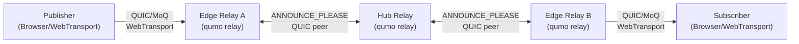
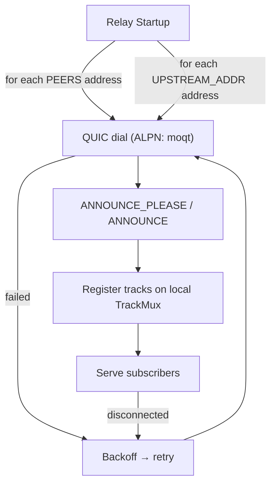

## System overview

A node's role (`--role hub`, `--role edge`, or unset for a flat/standalone
relay) is a CLI flag on `qumo relay` — see [CLI → relay]().

## Peer discovery

There is no runtime discovery service — on startup, each relay dials a fixed,
comma-separated list of addresses from two env vars:

1. **`PEERS`** — static peer addresses to dial and maintain a connection to.
2. **`UPSTREAM_ADDR`** — upstream relay address(es), e.g. for an edge dialing
   its hub(s), or any relay connecting upward in a hierarchy. Accepts a name
   that resolves to a stable address for the peer (a Consul DNS name, a Docker
   network alias, a fixed host:port). See [Nomad]() for
   a worked example on Nomad.

Both lists are dialed the same way and merged. `--role hub`/`--role edge` is a
CLI flag on `qumo relay`; it is an operator-facing label logged at startup for
visibility only and has no effect on which addresses are dialed.

Each connection dials QUIC with ALPN `moqt`, exchanges `ANNOUNCE_PLEASE` /
`ANNOUNCE`, and registers the peer's tracks on the local `TrackMux`. On
disconnect the connection is retried with exponential backoff (1s base, 30s
cap, ±25% jitter).

## Route election

When more than one peer path can serve the same broadcast, the relay elects
one active route and keeps the losers as retained alternates, promoted if the
incumbent's announcement ends.

Replacement is **not** a plain better/worse comparison. Liveness and hop count
are structural, so they decide outright — a live route always beats a dead one,
and fewer hops wins. Bitrate and RTT are noisy, so they only displace an
incumbent by clearing a hysteresis margin:

- **Bitrate** breaks a hop-count tie. The candidate must reach at least **120%**
  of the incumbent's estimated bitrate.
- **RTT** is consulted only when estimated bitrate is *equal* (or unknown on
  either side). The candidate must be lower by **at least 5 ms** *or* be under
  **80%** of the incumbent's RTT — either margin suffices.

Without those margins every edge converges on whichever hub momentarily
measures best, and the mesh flaps. A candidate that is genuinely better but
sits inside a margin does not take over, and is counted as a rejection.

This is visible via the
`qumo_relay_route_replacements_total`, `qumo_relay_route_rejections_total`,
`qumo_relay_routes_retained`, and `qumo_relay_route_promotions_total` metrics — see
[Observability]().

## Graceful migration

Route/subscription migration (make-before-break via route election) is the
primary mobility mechanism. `GOAWAY_REDIRECT_URI` is an escape-hatch: on
shutdown, it redirects clients/peers to a successor relay. See
[Configuration](#graceful-migration--goaway-optional).

## Related

- [Docker]() — running relays as containers, with static `PEERS`.
- [Nomad]() — the same static-address topology, deployed on Nomad.
- [Configuration → Static peers](#static-peers).
