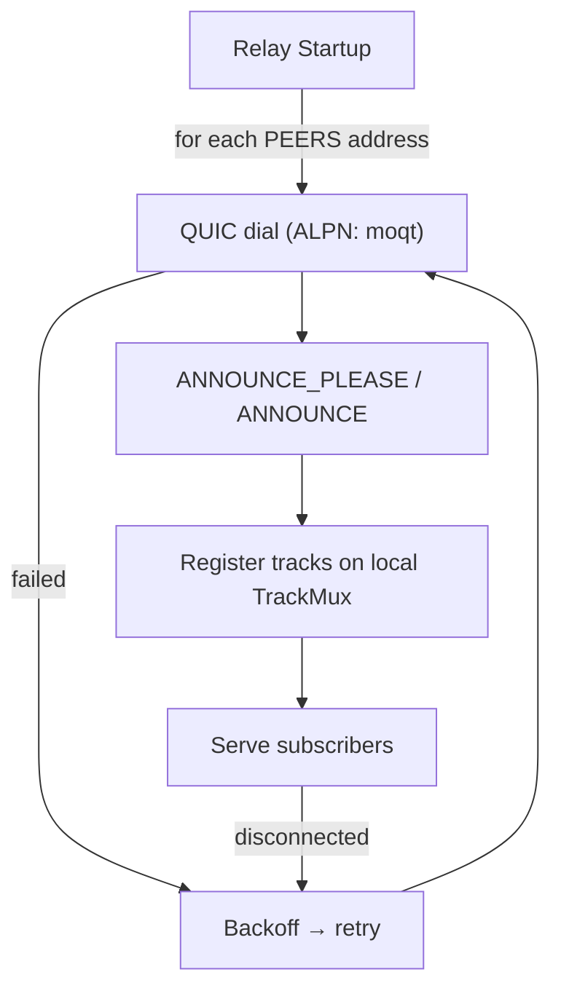

## System overview

```mermaid
graph LR
    Publisher["Publisher<br/>(Browser/WebTransport)"]
    Hub["Hub Relay<br/>(qumo relay)"]
    EdgeA["Edge Relay A<br/>(qumo relay)"]
    EdgeB["Edge Relay B<br/>(qumo relay)"]
    Subscriber["Subscriber<br/>(Browser/WebTransport)"]

    Publisher -->|"QUIC/MoQ<br/>WebTransport"| EdgeA
    EdgeA <-->|"ANNOUNCE_PLEASE<br/>QUIC peer"| Hub
    Hub <-->|"ANNOUNCE_PLEASE<br/>QUIC peer"| EdgeB
    EdgeB -->|"QUIC/MoQ<br/>WebTransport"| Subscriber
```

A node's role (`--role hub`, `--role edge`, or unset for a flat/standalone
relay) is a CLI flag on `qumo relay` — see [CLI → relay]().

## Peer discovery

There is no runtime discovery service — on startup, each relay dials the
fixed, comma-separated list of addresses in **`PEERS`**: e.g. an edge's hub(s),
or any relay it peers with. Each host is resolved to all its addresses and
every address is dialed, so a name for a group of relays (a Consul DNS name, a
Docker network alias) connects to each of them. See [Nomad]()
for a worked example on Nomad.

`--role hub`/`--role edge` is a CLI flag on `qumo relay`; it is an
operator-facing label logged at startup for visibility only and has no effect
on which addresses are dialed.

Peers authenticate each other with mutual TLS under a relay CA (`CA_FILE`,
`PEER_CERT_FILE`, `PEER_KEY_FILE`); a relay with `PEERS` refuses to start
without them. See [TLS & mTLS](#trusted-peers-optional).
A relay whose `PEERS` resolve to itself drops that session. Announcements
flow both ways over one peer session, so one side's `PEERS` naming the
other is enough for both to relay each other's broadcasts; listing every
relay on every relay only saves the dial from depending on which started
first.

Each connection dials QUIC with ALPN `moqt`, exchanges `ANNOUNCE_PLEASE` /
`ANNOUNCE`, and registers the peer's tracks on the local `TrackMux`. On
disconnect the connection is retried with exponential backoff (1s base, 30s
cap, ±25% jitter).

```mermaid
graph TD
    Start["Relay Startup"]

    Start -->|"for each PEERS address"| ALPN

    ALPN["QUIC dial (ALPN: moqt)"] --> Announce["ANNOUNCE_PLEASE / ANNOUNCE"]
    Announce --> TrackMux["Register tracks on local TrackMux"]
    TrackMux --> Serve["Serve subscribers"]

    ALPN -->|"failed"| Retry["Backoff → retry"]
    Serve -->|"disconnected"| Retry
    Retry --> ALPN
```

## Route election

When more than one peer path can serve the same broadcast, the relay elects
one active route and keeps the losers as retained alternates, promoted if the
incumbent's announcement ends.

Replacement is **not** a plain better/worse comparison. Liveness and hop count
are structural, so they decide outright — a live route always beats a dead one,
and fewer hops wins. Bitrate and RTT are noisy, so they only displace an
incumbent by clearing a hysteresis margin:

- **Bitrate** breaks a hop-count tie. The candidate must reach at least **120%**
  of the incumbent's estimated bitrate.
- **RTT** is consulted only when estimated bitrate is *equal* (or unknown on
  either side). The candidate must be lower by **at least 5 ms** *or* be under
  **80%** of the incumbent's RTT — either margin suffices.

Without those margins every edge converges on whichever hub momentarily
measures best, and the mesh flaps. A candidate that is genuinely better but
sits inside a margin does not take over, and is counted as a rejection.

This is visible via the
`qumo_relay_route_replacements_total`, `qumo_relay_route_rejections_total`,
`qumo_relay_routes_retained`, and `qumo_relay_route_promotions_total` metrics — see
[Observability]().

## Graceful migration

Route/subscription migration (make-before-break via route election) is the
primary mobility mechanism. `GOAWAY_REDIRECT_URI` is an escape-hatch: on
shutdown, it redirects clients/peers to a successor relay. See
[Configuration](#graceful-migration--goaway-optional).

## Related

- [Docker]() — running relays as containers, with static `PEERS`.
- [Nomad]() — the same static-address topology, deployed on Nomad.
- [Configuration → Static peers](#static-peers).
